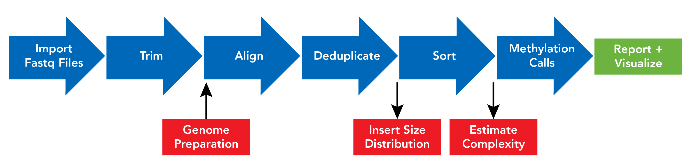
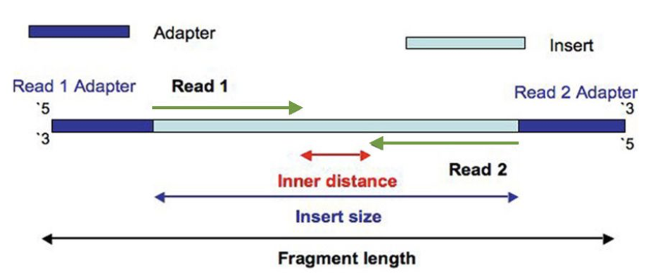
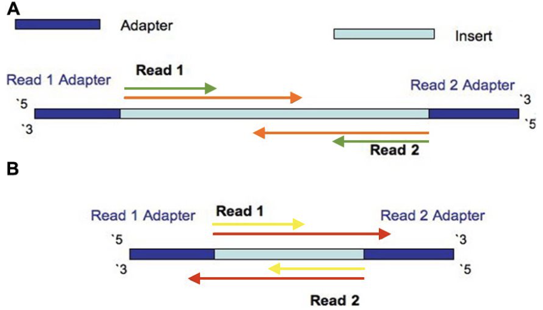

# NuGEN Methylation Whole-Genome Analysis Guide for Paired-End Illumina Sequencing.

For help with NuGEN products, contact NuGEN Technical Services [techserv@nugen.com](mailto:techserv@nugen.com) or post
 [an issue](https://github.com/nugentechnologies/NuMetWG/issues/new) here

## Who is this package for?

This package is for scientists experienced with command-line tools who want to analyze bisulfite- and
 oxidative-bisulfite-treated DNA libraries from NuGEN (Ovation® Ultralow Methyl-Seq Library Systems) kits.

Instructions below provide guidance on how to perform basic QC and preparation steps as well as analysis steps
 required to identify 5-methylcytosine or 5-hydroxymethylcytosine.

*Figure 1: Bioinformatics workflow including estimated compute time as percentage of total.*




*Table 1: Table of all steps for analysis including recommended software and website.*


| Step                                        | Software                         | Website                                             |
|---------------------------------------------|----------------------------------|-----------------------------------------------------|
| QC of fastq files                           | fastqc                           | http://www.bioinformatics.babraham.ac.uk/proje...   |
| Filter for sequence quality & read trimming | cutadapt                         | http://github.com/marcelm/cutadapt/releases         |
| Alignment                                   | Bismark                          | http://www.bioinformatics.babraham.ac.uk/proje...   |
| Fragment size analysis                      | Picard CollectInsertSizeMetrics  | http://broadinstitute.github.io/picard              |
| Remove duplicate reads                      | deduplicate\_bismark             | http://www.bioinformatics.babraham.ac.uk/proje...   |
| Diversity rate & estimation of duplicates   | Preseq                           | http://smithlabresearch.org/software/preseq         |
| Read coverage and GC content stats          | qualimap                         | https://bitbucket.org/kokonech/qualimap             |
| Methylation calls                           | bismark \_methylation\_extractor | http://www.bioinformatics.babraham.ac.uk/proje...   |
| Reporting                                   | multiQC                          | https://github.com/ewels/MultiQC                    |
| Differential methylation                    | methylKit                        | https://bitbucket.org/cegx-bfx/cegxtools            |
| Estimate hydroxymethylation                 | methpipe/mLmL                    | https://github.com/smithlabcode/methpipe/           |
| Visualization                               | IGV                              | https://www.broadinstitute.org/igv/                 |


# Pre-alignment

## Paired-end subsampling of read datasets

In order to produce a small testing dataset during the setup of the tools described in this document,
 the tool seqtk sample can be used to randomly subsample a subset number of reads from a pair of fastq.gz files (*R1* and *R2*).
 Instructions on how to install this software and its dependencies can be found [on their github page](http://github.com/lh3/seqtk).

### Command line arguments to run `seqtk sample`

Tool(s): 

  - `seqtk`
  - `gzip`

Input file(s):

  - `SAMPLE_R1.fastq.gz`
  - `SAMPLE_R2.fastq.gz`
  
Output files(s):

  - `SAMPLE_R1.seqtk_sample.1000000.fastq.gz`
  - `SAMPLE_R2.seqtk_sample.1000000.fastq.gz`

```
seqtk sample -s987654321 SAMPLE_R1.fastq.gz 1000000 | gzip -c > SAMPLE_R1.seqtk_sample.1000000.fastq.gz
```

And for *R2* use the same seed value:

```
seqtk sample -s987654321 SAMPLE_R2.fastq.gz 1000000 | gzip -c > SAMPLE_R2.seqtk_sample.1000000.fastq.gz
```

This will produce the `SAMPLE_R1.seqtk_sample.1000000.fastq.gz` and `SAMPLE_R2.seqtk_sample.1000000.fastq.gz` files.

These files can be used for faster testing of the different steps described in this document.

## Sequencing QC

Given the `fastq.gz` files produced by Illumina sequencing, the quality of the sequencing data can be assessed using FastQC.
 Use cases are detailed below in Table3. Instructions on how to install this software tool and dependencies can be found 
 [here](http://www.bioinformatics.babraham.ac.uk/projects/fastqc).

These tools will perform a suite of QC analyses on the raw sequencing data and highlight any abnormal
 metrics that could affect further analysis. Abnormal metrics at this step may indicate sequencing runs that
 underperformed according to the manufacturer’s specifications due to sample quality, cluster density and/or other experimental factors.

### FastQC:

Tool(s):

  - `fastqc`

Input file(s):

  - `SAMPLE_R1.fastq.gz`
  - `SAMPLE_R2.fastq.gz`

Output files(s):

  - `SAMPLE_R1_fastqc.zip`
  - `SAMPLE_R2_fastqc_zip`


    fastqc SAMPLE_R1.fastq.gz SAMPLE_R2.fastq.gz

## Pre-alignment paired-end sequence trimming and filtering

Given input files that have passed sequencing QC, they should then be filtered for
 [sequencing quality](https://en.wikipedia.org/wiki/FASTQ_format#Quality) and undergo adapter removal.
 This can be achieved with sequence trimming software, such as cutadapt.

Instructions on how to install this software and its dependencies can be found
 [on their github page](http://github.com/marcelm/cutadapt/releases)

The statistics of cutadapt read trimming can be conveniently browsed in the MultiQC report
(see MultiQC section of this document to learn how to produce this report).

Tool(s):
  - `cutadapt`

Input file(s):
  - `SAMPLE_R1.fastq.gz`
  - `SAMPLE_R2.fastq.gz`


Output files(s):
  - `SAMPLE_R1.trimmed.fq.gz`
  - `SAMPLE_R2.trimmed.fq.gz`


This command assumes the adapter sequences: AGATCGGAAGAGC, AGATCGGAAGAGC

``` 
cutadapt –q 20 –m 15 -a AGATCGGAAGAGC -A AGATCGGAAGAGC -o SAMPLE_R1.trimmed.fq.gz -p SAMPLE_R2.trimmed.fq.gz SAMPLE_R1.fastq.gz SAMPLE_R2.fastq.gz
```

This will produce the `SAMPLE_R1.trimmed.fq.gz` and `SAMPLE_R2.trimmed.fq.gz` files.

# Alignment

## Paired-End alignment of reads to a reference genome

Given sequence data that has passed the sequence QC and trimming steps; the trimmed reads should then be aligned to a reference genome using
 an alignment strategy for bisulfite converted DNA such as that implemented in the Bismark software suite that we recommend you use.
 Instructions on how to install this software and its dependencies can be found [here](http://www.bioinformatics.babraham.ac.uk/projects/bismark/)

The aligner should report the mapping efficiency of the reads to the genome. A low mapping efficiency could indicate issues with the samples.

The two basic steps of alignment using the bismark algorithm are:

  1. Genome preparation
     Process genome reference file and build bowtie indices for use by the Bismark alignment strategy.
  2. Alignment
     Run bismark with the trimmed sequences against the converted reference that matches the sample.

### Command line argument to run `bismark` alignment:

Genome preparation step:

Tool(s):

  - `bismark_genome_preparation`

Input file(s):

  - `/path/to/fasta/genome/*.fa`

Output folder(s):

  - `/path/to/fasta/genome/Bisulfite_genome/`


```
bismark_genome_preparation /path/to/fasta/genome
```

Alignment step:

Tool(s):

  - `bismark`
  - `bowtie` or `bowtie2` is required

Input file(s):

  - `SAMPLE_R1.cut.fq.gz`
  - `SAMPLE_R2.cut.fq.gz`
 
Input folder(s):

  - `/path/to/fasta/genome`
  
Output file(s):

  - `SAMPLE_R1.cut.fq.gz_bismark_bt2_pe.bam`
  - `SAMPLE_R1.cut.fq.gz_bismark_bt2_PE_report.txt`
 

```
bismark --bam --maxins 500 /path/to/fasta/genome -1 SAMPLE_R1.trimmed/cut.fq.gz -2 SAMPLE_R2.trimmed/cut.fq.gz
```

The `.txt` file produced in this step contains a report of the `bismark` alignment step.

The `.bam` file produced in this step describes the alignment of each read (or read pair) to the reference. 
The reads in this `.bam` file are unsorted and may contain duplicates. 
This file will be referred to as `SAMPLE.bam` from here on for simplicity.

Note:
The alignment step is computationally intensive and RAM should be sufficient to accommodate roughly 3 times the
 size of the reference sequence in base pairs. 
 For example, for the alignment against the human reference, more than 10.5GB of RAM is required.
 For further guidelines refer to the Bismark user guide.

# Post-alignment tools

## Post-alignment paired-end insert size distribution

Given a sequencing dataset that has been aligned, it is informative to produce a quantitation report on the size of
 the fragments that were successfully sequenced. This can be compared to the fragment size distribution obtained
 from a digital quantitation instrument before sequencing, e.g. a Bioanalyzer fragment sizing report. 
 
The histogram curve in the quantitation report and the histogram curve in this pre-sequencing analysis
 should be similar in shape. It is important to diagnose the data sets at this step: dramatic differences
 between the two histogram curves may be caused by abnormal clustering in the sequencing step which can
 negatively influence downstream results (see Post-alignment Paired-End Clipping Overlap statistics section).

The analysis of fragment sizes in the aligned data can be achieved by running `picard CollectInsertSizeMetrics`
 on the aligned reads of a given sample, present in the SAMPLE.bam file. Instructions on how to install Picard
 and its dependencies can be found at: http://broadinstitute.github.io/picard. Simple installation of picard
 and dependencies can be performed with the [bioconda package](https://bioconda.github.io/recipes/picard/README.html)

Tool(s):

  - `picard CollectInsertSizeMetrics`

Input file(s):

  - `SAMPLE.bam`
  
Output file(s):

  - `SAMPLE_picard_insert_size_metrics.txt`
  - `SAMPLE_picard_insert_size_plot.pdf`

```
java –Xmx4g -XX:+UseG1GC -XX:ParallelGCThreads=2 -jar /path/to/Picard/picard.jar CollectInsertSizeMetrics \
  INPUT=SAMPLE.bam OUTPUT=SAMPLE_picard_insert_size_metrics.txt \
  HISTOGRAM_FILE=SAMPLE_picard_insert_size_plot.pdf METRIC_ACCUMULATION_LEVEL=ALL_READS
```

The `.pdf` output plot will show a histogram of fragment insert sizes. The `.txt` output file will show the resulting
 metrics as described [here](https://broadinstitute.github.io/picard/picard-metric-definitions.html#InsertSizeMetrics)

## Post-alignment remove duplicate reads

Reads that arise from artifacts in library preparation and sequencing must be removed or marked so that the methylation events are not double-counted.
This can be done using deduplicate_bismark.

Given an aligned dataset produced by `bismark`, e.g. `SAMPLE.bam`, the tool `deduplicate_bismark` that comes with `bismark`
 can be used to remove or mark the duplicate reads in one single step. The tool deduplicate_bismark will not require
 pre-sorting of the `.bam` file and produces a deduplicated read name sorted output file that is ready to be used in
 the downstream methylation counting step.

Tool(s):

  - `deduplicate_bismark`

Input file(s):

  - `SAMPLE.bam`
 
Output files(s):

  - `SAMPLE.deduplicated.bam`


```
deduplicate_bismark -p --bam SAMPLE.bam
```

## Post-alignment diversity and duplication rate

Several bioinformatics tools are available to mark and remove duplicates,
 while other tools can also estimate library diversity based on identifying duplicates.
Preseq is one of the most accurate and informative of the tools to estimate diversity
 and extrapolate duplication rates at higher depths
Instructions on how to install this software and its dependencies can be found 
 on the Smith Lab [website](http://smithlabresearch.org/software/preseq).

### Post-alignment extrapolation of yields of distinct reads

Preseq lc_extrap computes the expected future yield of distinct reads and bounds on the number of total distinct
 reads in the library and the associated confidence intervals. It can be used on a `.bam` file containing a certain
 number of duplicates, I.e. the output `.bam` file after alignment but before duplicate removal.

The output of `preseq lc_extrap` can be plotted in a curve indicating the ratio of “number of molecules (M)”
 and “number of distinct molecules (M)”. The difference between the two numbers indicates the amount of 
 duplicate reads at the different extrapolated depths of sequencing.

Preseq lc_extrap is a useful tool to see if a certain sample preparation condition will render acceptable libraries
 for the desired experiment depth. For example, if a given sample has been sequenced at 5x coverage and
 gives 4% duplicates, the preseq lc_extrap curve can be followed to obtain the extrapolated number of duplicates
 if the same sample is sequenced at 10x, 30x, 100x, etc.
As shown in the examples, the relationship between depth of sequencing and the percentage of duplicates is not
 linear and changes following a curve as the number of sampled fragments increases.

Tool(s):

 - `preseq lc_extrap`

Input file(s):

  - `SAMPLE.bam` 
	 
	 
Output file(s): 	

  - `SAMPLE.preseq.lc_extrap.tsv` 


```
preseq lc_extrap -B –P -e 2000100000 -o SAMPLE.preseq.lc_extrap.tsv SAMPLE.bam
```

`preseq lc_extrap` can fail to estimate the curve if there are not enough reads in the aligned `.bam` file for the calculation.
The error reported is:

    ERROR: max count before zero is less than min required count (4), sample not sufficiently deep or duplicates removed

The statistics of preseq lc_extrap can be conveniently browsed in the MultiQC report (see MultiQC section of this document).

### Post-alignment estimation of diversity

Preseq bound_pop is a tool that we recommend to estimate the diversity of a sample. The resulting value from
 `preseq bound_pop` can be used to compare the relative performance of different sample preparations.
 In comparable conditions, a higher value from preseq bound_pop indicates a more diverse sample.

`preseq bound_pop` implements a method that improves upon the Poisson lower bound model of estimating diversity values.

Although an improvement on the poisson model, preseq bound_pop may still underestimate the
 true diversity of the population, as it is an estimate of the lower bound.

Tool(s):

  - `preseq bound_pop`

Input file(s):

  - `SAMPLE.bam`

Output file(s):

  - `SAMPLE.preseq.bound_pop.tsv` 

```
preseq bound_pop -B -P -o SAMPLE.preseq.bound_pop.tsv SAMPLE.bam
```


## Post-alignment read coverage and GC-content statistics

Given an aligned dataset, it is informative to produce a report with the read coverage and
GC-content statistics of the alignment to the reference.

Such statistics of an aligned dataset can be produced by running qualimap bamqc
 on the aligned reads of a given sample in the `SAMPLE.bam` file.

Instructions on how to install Qualimap on their [bitbucket page](https://bitbucket.org/kokonech/qualimap)

Tool(s):

  - `qualimap bamqc`

Input file(s):

  - `SAMPLE.bam`

Output dir(s):

  - `/SAMPLE_stats/`


```
qualimap bamqc -sd -c -bam SAMPLE.bam
```

Qualimap will produce an extensive report that includes read coverage and GC-content statistics.
 You can conveniently browse the results of the report by running MultiQC on the PROJECT folder
 (see MultiQC section of this document).

## Post-alignment methylation counts

Once the reads have been aligned, the methylation status of each cytosine position can be determined.
 The bismark aligner provides a tool for this purpose called bismark_methylation_extractor.
 This tool produces a text-based output containing the coordinates and methylation status of each cytosine.
 A print-out of the coverage at each cytosine can be obtained by specifying the `–bedGraph` flag.
 This then needs to be passed through `bedGraph2cytosine` (also part of bismark) to produce the
 required methylation status and coverage report.
 A cytosine report of all converted and unconverted cytosines in the `CpG` context can be produced by
 specifying the `--cytosine_report` flag. The output files can be compressed by specifying the `--gzip` flag.
 The input for `bismark_methylation_extractor` is a filtered `.bam` file sorted by read
 name from the Remove Duplicate Reads step.

Tool(s):

  - `bismark_methylation_extractor`


Input file(s):

  - `SAMPLE.rmdup.nsorted.bam`

Output files(s):

  - `CHG_CTOT_SAMPLE.txt.gz`
  - `CHH_CTOT_SAMPLE.txt.gz`
  - `CpG_CTOT_SAMPLE.txt.gz`
  - `CHG_CTOB_SAMPLE.txt.gz`
  - `CHH_CTOB_SAMPLE.txt.gz`
  - `CpG_CTOB_SAMPLE.txt.gz`
  - `SAMPLE.M-bias_R1.png`
  - `SAMPLE.M-bias.txt`
  - `SAMPLE.bam_splitting_report.txt.gz`
  - `SAMPLE.bedGraph.gz SAMPLE.bismark.cov.gz`
  - `SAMPLE.bismark.CpG_report.gz`

```
bismark_methylation_extractor --buffer-size 20G --gzip --cytosine_report \
    --bedGraph --genome_folder /path/to/fasta/human/GRCh38/ \
    SAMPLE.rmdup.nsorted.fm.flt.bam
 ```
 
## Post-alignment paired-end clipping overlap statistics

Given an aligned dataset containing paired-end Illumina reads, a number of the paired-end reads can
 overlap if the library insert size produced contains fragments smaller than the sum of the number of cycles of the paired-end run.

### Example 1

For a 2x75bp run, the sum of the number of cycles is 75+75=150 cycles. If the library contains
 fragments smaller than 150bp, reading those fragments with paired-end
 2x75bp Illumina reads will cause a number of bases to overlap. The fragments in the same library
 that are longer or equal to 150bp will not have overlapping bases.


### Example 2

If the same library in example 1 is sequenced again, in this example with a
 2x150bp run, the sum of the number of cycles in this run will be 150+150=300 cycles.
 This means that, for any fragment in the library insert size that is shorter than 300bp,
 there will be bases of the paired-end reads overlapping each other.
 Fragments in this sample that are between 151bp and 299bp will have bases overlapping, but they would not have overlapping bases in Example 1.
 The fragments in the same library that are longer than 300bp will not have overlapping bases in Example 1 nor in Example 2.

The methylation status of a sample can be biased by double-counting the converted and protected C’s in the overlapping paired-end reads.
 This bias can be prevented by running bismark_methylation_extractor with default parameters (not using
 `--include_overlap` flag).
 The final number of usable bases for the bismark_methylation_extractor analysis will be
 smaller than the number of bases given in the input `.bam` file due to clip overlap.

Figures 2-3 illustrate examples ranging from non-overlapping pairs (green reads in Figure 2 and Figure 3A)
 to pairs with increasing overlaps on longer read pairs or shorter templates
 (orange reads in Figure 3A and yellow or red reads in Figure 3B).
 
*Figure 2: This figure was adapted from http://journal.frontiersin.org/article/10.3389/fgene.2014.00005/full
 and illustrates reads with no overlap.*




*Figure 3: This figure was adapted from http://journal.frontiersin.org/article/10.3389/fgene.2014.00005/full and illustrates reads with moderate overlap (A) and extreme overlap (B).*




The extreme case depicted in Figure 3B is the red pair of reads, where read 1 (pointing to the right) goes beyond
 the length of the fragment and starts sequencing into the 3’ adapter sequence (dark blue).
 The red read 2 (pointing to the left) also goes beyond the length of the fragment and starts sequencing into the
 5’ adapter sequence (dark blue). Read pairs like this extreme case will be difficult to align to the reference genome
 and will cause a sudden drop in the alignment rate at such insert sizes. The drop in the alignment rate will occur at
 the length equal to the number of cycles sequenced minus the length of the barcode.


  - For a 2x75bp run, fragments shorter than 75bp-10bp=65bp will be difficult to align, so there will be a sudden drop in the alignment rate at insert size = 65bp.
  - For a 2x150bp run, fragments shorter than 150bp-10bp=140bp will be difficult to align, so there will be a drop in the alignment rate at insert size = 140bp.
  This drop will be less pronounced because a 140bp fragment is easier to align to the reference genome than a 65bp fragment.

### Calculate overlap statistics

The calculate_clip_overlap tool can be used to estimate the percentage of usable bases after
 accounting for overlap clipping at different run types (2x75, 2x100, 2x125, 2x150,
2x250, etc.).

Download `calculate_clip_overlap.pl`
 [here](https://github.com/avilella/calculate_clip_overlap/archive/calculate_clip_overlap-v.1.0.tar.gz)

Tool(s):

  - `calculate_clip_overlap.pl`

Input file(s):

  - `SAMPLE.bam`

Output files(s):

  - `SAMPLE.clip_overlap.txt`

```
perl calculate_clip_overlap.pl -i SAMPLE.bam -observed 2x125
```

## Pre-alignment, alignment and post-alignment paired-end report for single or multiple samples

Given a sample or collection of samples from a project that has been analysed with the steps described in this document,
 a report can be produced with a selection of important metrics. MultiQC is a tool to aggregate the relevant
 information produced at each data analysis step into a single report for one or multiple samples.

MultiQC searches a given directory for analysis logs and compiles an HTML report.
 It is a general use tool for summarising the output of numerous bioinformatics tools.

Instructions on how to install this software and its dependencies can be found at
 their [github page](https://github.com/ewels/MultiQC)


Tool(s):

  - `multiqc`

Input directory:

  - `/directory/root/with/directories/for/each/sample`

Output files(s):

  - `multiqc_report.html`


```
multiqc --force /path/to/project
```

Please refer to the [documentation of MultiQC](http://multiqc.info/)
 or [YouTube](https://www.youtube.com/watch?v=qPbIlO_KWN0)
 for instructions on how to filter and highlight samples as well as adjust read names.

## Visualizing aligned data sets

Once the alignments have been produced, an alignment visualization tool can be used to visually verify the quality of the data obtained.

The Integrated Genomics Viewer (IGV) is a high-performance visualization tool for interactive exploration of large, integrated genomic datasets.
 It supports a wide variety of data types, including array-based and next-generation sequencing data and genomic annotations.

Instructions on how to install this software and its dependencies can be found at:
https://www.broadinstitute.org/igv/

Instructions on how to label the read information for bisulfite mode can be found at:
https://www.broadinstitute.org/igv/interpreting_bisulfite_mode

# Multi-sample analysis

## Differential methylation analysis

### methylKit

There are a number of software tools to analyse methylation data sets for differential methylation discovery.
 Out of those, `methylKit` is a tool that provides the most functionality for many user cases (see the appendix for a listing of other available tools).
 Instructions on how to install this software are on thier [github page](http://github.com/al2na/methylKit)

The `cegxtools` repository contains a [script](https://goo.gl/9URSXz)to call `methylKit`.


### Command line argument for an example of a CASE vs CONTROL analysis with two replicates (four total samples):

Tool(s):

  - `cegxtools/scripts/run_methylkit_four_samples.R


Input file(s):

  - `CASE1.CpG_report.txt.gz`
  - `CASE2.CpG_report.txt.gz`
  - `CONTROL1.CpG_report.txt.gz`
  - `CONTROL2.CpG_report.txt.gz`
 
Output file(s):

  - report directory


```
Rscript run_methylkit_four_samples.R CASE1.CpG_report.txt.gz CASE2.CpG_report.txt.gz CONTROL1.CpG_report.txt.gz CONTROL2.CpG_report.txt.gz 10
```

## Estimation of hydroxymethylation and methylation levels from BS (BS) and oxBS methylation counts

The hydroxymethylation and methylation levels from a sample can be estimated when both oxidative bisulfite sequencing
 (oxBS) and bisulfite sequencing (BS) have been performed for the same sample.

The software methpipe/mlml can be used to perform consistent and simultaneous estimation of hydroxymethylation and
 methylation given the methylation counts of BS and oxBS experiments. Instructions on how to install this software
 and its dependencies can be found on the Smith Lab [website](https://github.com/smithlabcode/methpipe/)

### Command line argument to run methpipe/mlml

An example of a BS and oxBS analysis is described below:

Tool(s):

  - `methpipe/mlml`

Input file(s):

  - `SAMPLE-BS.methcounts.bed.gz`
  - `SAMPLE-oxBS.methcounts.bed.gz`

Output file(s):

  - `SAMPLE-BS.vs.SAMPLE-oxBS.mlml.txt`


```
methpipe/mlml -v -bsseq SAMPLE-BS.methcounts.bed.gz -oxbsseq SAMPLE-oxBS.methcounts.bed.gz -output SAMPLE-BS.vs.SAMPLE-oxBS.mlml.txt
```

The input files with the methcounts.bed.gz format can be obtained by preprocessing the CpG_report.txt.gz.
 In this pre-processing step, the coverage for each of the strands of a given `CpG` can be combined to produce one
 entry per `CpG` in the ‘+’ strand. This is the recommended setting for datasets where the coverage is below 40x.
 Find out more details in the `cegxtools` repository: https://bitbucket.org/cegx-bfx/cegxtools

The output file will contain the `C`/`mC`/`hmC` levels for each genomic position in the input files.

Visualising `5hmC` and `5mC` profiles in various genome browsers (e.g. IGV, UCSC, WashU Epigenome Browser, Gencode Biodalliance)
 can be achieved by converting the MLML output to both BedGraph and BigWig files.
 A BedGraph file must first be generated and then converted to a BigWig file.

The Bismark suite uses a 0-based start and 1-based end coordinate system.
 Some genome browsers, such as Ensembl, use a 1-based coordinate system, others use
 0-based. The coordinate system should be transformed accordingly while generating the BedGraph file, or kept in mind when browsing the profile.
 
Tool(s):

  - `egrep`
  - `cut`
  - `sort`

Input file(s):
  - `SAMPLE-BS.vs.SAMPLE-oxBS.mlml.txt`
	
Output file(s):

  - `SAMPLE-BS.vs.SAMPLE-oxBS.mlml.mc.bedgraph`
  - `SAMPLE-BS.vs.SAMPLE-oxBS.mlml.hmc.bedgraph`

For 5mC estimates:

```
egrep -v 'EBV|KN|JTFN|nan' SAMPLE-BS.vs.SAMPLE-oxBS.mlml.txt | cut-f1,2,3,4 | sort -k1,1 -k2,2n > SAMPLE-BS.vs.SAMPLE-oxBS.mlml.mc.bedgraph
```

For 5hmC estimates:

```
egrep -v 'EBV|KN|JTFN|nan' SAMPLE-BS.vs.SAMPLE-oxBS.mlml.txt | cut-f1,2,3,5 | sort -k1,1 -k2,2n > SAMPLE-BS.vs.SAMPLE-oxBS.mlml.hmc.bedgraph
```

[bedGraphToBigWig](https://github.com/ENCODE-DCC/kentUtils/tree/master/bin/linux.x86_64),
 can be used to convert a BedGraph file to BigWig format, which can be read efficiently by most genome browsers.
 This tool additionally requires a text file that lists the size in base pairs for each chromosome in the reference genome.
 The easiest way to generate this file is to obtain the `fetchChromSizes` tool from
 [kentUtils](https://github.com/ENCODE-DCC/kentUtils/tree/master/bin/linux.x86_64)
 and run this first to obtain the chromosome sizes file.

Input file(s):

  - `SAMPLE-BS.vs.SAMPLE-oxBS.mlml.mc.bedgraph`
  - `SAMPLE-BS.vs.SAMPLE-oxBS.mlml.hmc.bedgraph`
  - `hg38.chrom.sizes`

Tool(s):

  - `bedGraphToBigWig`
  - `fetchChromSizes`

Output file(s):

  - `SAMPLE-BS.vs.SAMPLE-oxBS.mlml.txt`

Preparatory step for human genome (hg38) chromosome sizes file (only needs to be run once) :

```
fetchChromSizes hg38 /path/to/hg38.chrom.sizes
```

BedGraph to BigWig conversion step:

For 5mC:

```
bedGraphToBigWig SAMPLE-BS.vs.SAMPLE-oxBS.mlml.mc.bedgraph /path/to/hg38.chrom.sizes SAMPLE-BS.vs.SAMPLE-oxBS.mlml.mc.bw
```

For 5hmC:

```
bedGraphToBigWig SAMPLE-BS.vs.SAMPLE-oxBS.mlml.hmc.bedgraph /path/to/hg38.chrom.sizes SAMPLE-BS.vs.SAMPLE-oxBS.mlml.hmc.bw
```


# Appendix

## List of DMR calling tools in the literature


### BISEQ

Publication: http://www.ncbi.nlm.nih.gov/pubmed/23658421

Code: https://www.bioconductor.org/packages/release/bioc/html/BiSeq.html


### BSMOOTH/BSSEQ

Publication: http://www.ncbi.nlm.nih.gov/pubmed/23034175

Code: http://rafalab.jhsph.edu/bsmooth

Website: https://bioconductor.org/packages/release/bioc/html/bsseq.html


### COHCAP

Publication: http://www.ncbi.nlm.nih.gov/pubmed/23598999

Code: https://www.bioconductor.org/packages/release/bioc/html/COHCAP.html


### EDMR

Publication: http://www.ncbi.nlm.nih.gov/pubmed/23735126

Code: http://code.google.com/p/edmr/


### GLOBALTEST

Code: https://www.bioconductor.org/packages/release/bioc/html/globaltest.html


### LIMMA

Publication: http://www.ncbi.nlm.nih.gov/pubmed/25605792

Code: https://bioconductor.org/packages/release/bioc/html/limma.html


### MOABS

Publication: http://www.ncbi.nlm.nih.gov/pmc/articles/PMC4054608/ 

Code: http://code.google.com/p/moabs

*Copy: http://www.ncbi.nlm.nih.gov/pmc/articles/PMC4054608/bin/gb-2014-15-2-r38-S1.zip


### RADMETH

Code: http://smithlabresearch.org/software/radmeth/


### WFMM

Publication: http://www.ncbi.nlm.nih.gov/pubmed/26559505

Code: https://biostatistics.mdanderson.org/SoftwareDownload/SingleSoftware.aspx?Software_Id=70


### MethyBayes

Publication: http://www.ncbi.nlm.nih.gov/pubmed/26818685

Code: https://github.com/wangyuchen/MethyBayes


### Metilene

Publication: http://www.ncbi.nlm.nih.gov/pubmed/26631489

Code: http://www.bioinf.uni-leipzig.de/Software/metilene/metilene_v02-4.tar.gz

### CometGazer

Code: https://github.com/rifathamoudi/COMETgazer


### HMM-Fisher

Code: https://github.com/xxy39/HMM-Fisher


### HMM-DM

Code: https://github.com/xxy39/HMM-DM


### MethylSeekR

Publication: http://www.ncbi.nlm.nih.gov/pubmed/23828043

Code: https://www.bioconductor.org/packages/devel/bioc/html/MethylSeekR.html

### GetisDMR

Publication: http://www.ncbi.nlm.nih.gov/pubmed/27493194

Code: https://github.com/DMU-lilab/GetisDMR

### Anything we missed?

If you have success with another approach, please [let us know](https://github.com/nugentechnologies/NuMetWG/issues/new)!
